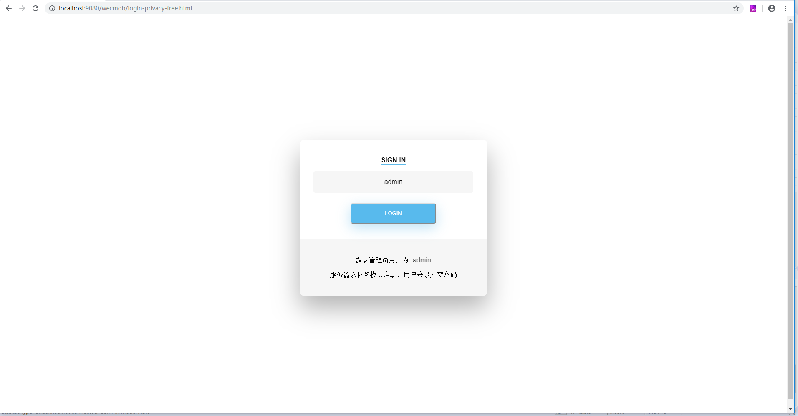
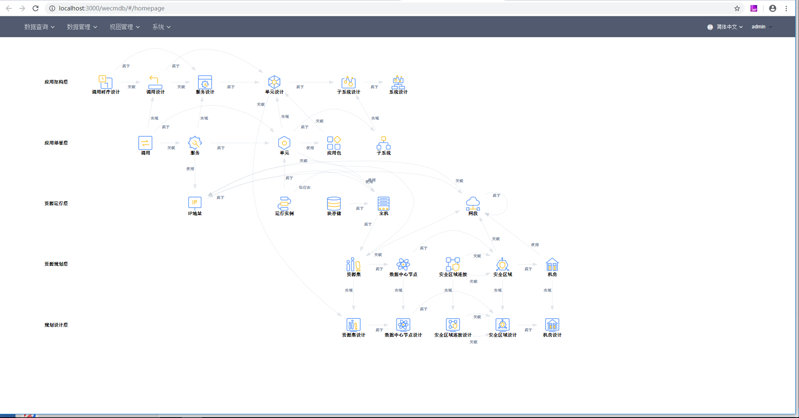

# WeCMDB 开发环境配置

## 准备工作
1. 安装JDK
	
	需要在开发电脑上先安装JDK，请参考[JDK安装文档](jdk_install_guide.md)

2. 安装Eclipse
	
	需要在开发电脑上先安装Eclipse，请参考[Eclipse安装文档](eclipse_install_guide.md)

3. 安装Mysql
	
	需要有一个Mysql数据库， 也可以在开发电脑上安装Mysql，请参考[Mysql安装文档](mysql_install_guide.md)

4. 安装node.js
	
	访问node.js官方网站：http://nodejs.cn/download， 下载v10.16.3版本。双击下载后的安装文件， 按默认配置进行安装。


## 导入工程
   可以直接从git上拉取代码， 也可以先将代码工程拉取到本地后， 再导入到Eclipse中， 本文以从本地导入为例。

1. 导入工程
	
	选择导入已有项目
	
	
	选择已有maven工程
	
	
	选择wecmdb的代码目录作为根目录
	
	
	
	确认后完成导入。
	
	

2. 切换视图
	
	导入项目后，需要在 *Window > Show View* 中选择 *Project Explorer*
	

3. 配置文件

	在 *Project Explorer* 视图中，将 *application-local.yml* 复制一份，更名为 *application-dev.yml*
	
	
	打开 *application-dev.yml* ，默认使用的是H2内存数据库，内容如下：

	```
    server:
      port: 9080
      address: localhost
    
    spring:
      datasource:
        platform: H2
        driver-class-name: org.h2.Driver
        url: jdbc:h2:mem:cmdb;MODE=MYSQL;DB_CLOSE_DELAY=-1;DB_CLOSE_ON_EXIT=true;MV_STORE=FALSE;INIT=CREATE SCHEMA IF NOT EXISTS wecmdb_dev\;SET SCHEMA wecmdb_dev
        username: sa
        password:
        schema: classpath:/database/01.cmdb.schema.sql
        data:
          - classpath:/database/02.cmdb.system.data.sql
          - classpath:/local/03.cmdb.system.data.h2.sql
          - classpath:/database/04.cmdb.experience.data.sql
        sql-script-encoding: utf-8
    
      jpa:
        database: MySQL
        database-platform: org.hibernate.dialect.MySQL5InnoDBDialect
        show-sql: false
        hibernate:
          ddl-auto: none
    
    cmdb:
      datasource:
        schema: wecmdb_dev
      security:
        enabled: false
        whitelist-ip-address: localhost
	
	```

	如需要使用已存在的MYSQL数据库，可修改配置如下：
	```
    server:
      port: 9080
      address: localhost
    
    spring:
      datasource:
        driver-class-name: com.mysql.cj.jdbc.Driver
        url: jdbc:mysql://localhost:3306/wecmdb_dev?characterEncoding=utf8&serverTimezone=Asia/Shanghai
        username: root
        password: 
    
      jpa:
        database: MySQL
        database-platform: org.hibernate.dialect.MySQL5InnoDBDialect
        show-sql: false
        hibernate:
          ddl-auto: none
    
    cmdb:
      datasource:
        schema: wecmdb_dev
      security:
        enabled: false
        whitelist-ip-address: localhost
	```
	如果你的数据库是空库，可以依次运行数据库初始化脚本：
	

4. 启动WeCMDB后端
	
	打开Window->Preferences窗口， 选择Java->Installed JREs，新增jdk配置，如下图

	

	下载依赖， 如下图：

	
	
	启动

	
	
	在浏览器输入 *http://localhost:9080/wecmdb/swagger-ui.html* 会跳转到登录页面

	

	


5. 启动WeCMDB前端
	
	运行CMD（Win+R或右下角点开始菜单的输入处），在展开的命令行窗口中,进入we-cmdb的代码子目录wecmdb-ui目录

	
	
	执行npm安装命令
	
	```
	npm install
	```
	
	

	安装完成后， 执行命令

	
	```
	npm start
	```

	如下图：

	

	服务已启动， 打开 *http://localhost:3000*, 可看到WeCMDB的页面

	